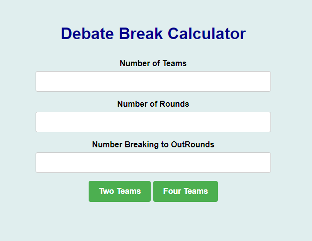

# Debate Break Calculator

## Overview
- Debating is an increasingly popular activity where teams will argue against each either in favour or against a motion (i.e. whether marijuana should be legalized). Thousands of debating tournaments are hosted every single year and the most recent Worlds Universities Debating Championships held in Thailand had over 1000 participants (https://wudc2020.herokuapp.com/wudc2020/)
- Typically debating tournaments consist of preliminary rounds and outrounds (i.e. quarterfinals or semifinals). In preliminary rounds, teams are ranked in comparison to other teams they debated against (determined by a panel of judges) and awarded points based off of their ranking. After preliminary rounds are over, teams with the highest amount of points advance, or "break", to outrounds. There can be a lot of variation in the number of points you need to advance to outrounds. With this in mind, Debate Break Calculator determines the best-case (lowest amount of points needed to break) and worst-case (highest amount of points needed to break) break scenarios based on the number of teams in the tournament, number of preliminary rounds, number of teams advancing to outrounds, and the style of debate

## Running the program
- note: if using windows instructions will only work using windows bash
- Install Python 3: https://www.python.org/downloads/
- Install virtualenv: `pip3 install virtualenv`
- At this point if you type `pip3` or `virtualenv` in your terminal, you should not get an error similar to `command not found`
- clone the repository
- run `source setup.sh` in the root folder
- run `flask run` in the root folder
- A flask server should start up and inform you what url the site is running on
- To terminate the server run `Ctrl` + `C`
- run `deactivate` to terminate the virtual environment

## Notes
- Style is the number of teams that are in one debate. For example British Parliamentary is 'Four Teams' while Canadian Parliamentary and Australs are 'Two Teams'
- The calculator assumes the tournament is using a bracketing system for each rounds draw. An explanation of the bracketing system can be found in the first paragraph of the following pdf: https://osdu.org/wp-content/uploads/2018/10/Bracketing_Scoring_System.pdf
- Things like team conflicts that alter the tournament draw may cause errors

## TO DO
- Edge Cases
    - No Guranteed Break
    - Only one round (already done I think)
- Errors
    - Form resubmission error for refresh after invalid input (should probably use post --> redirect --> get pattern)
    - Form error if input breaking as 0
